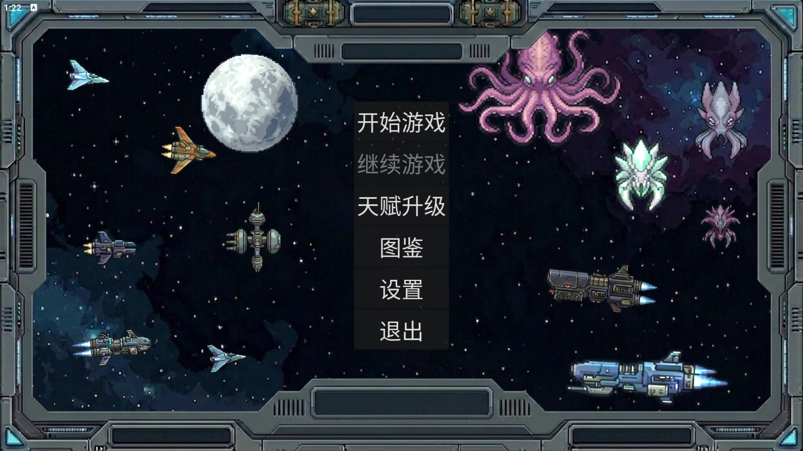
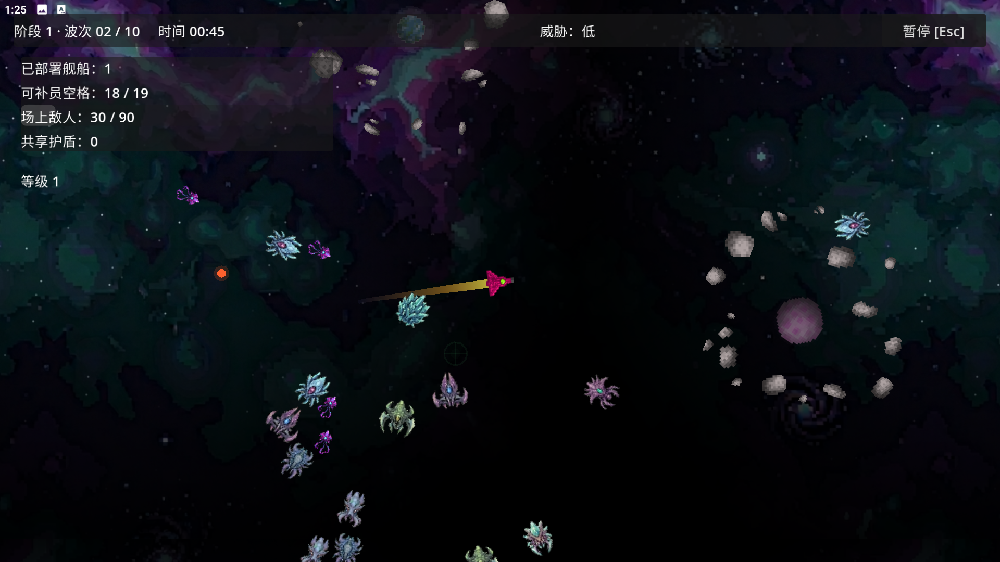
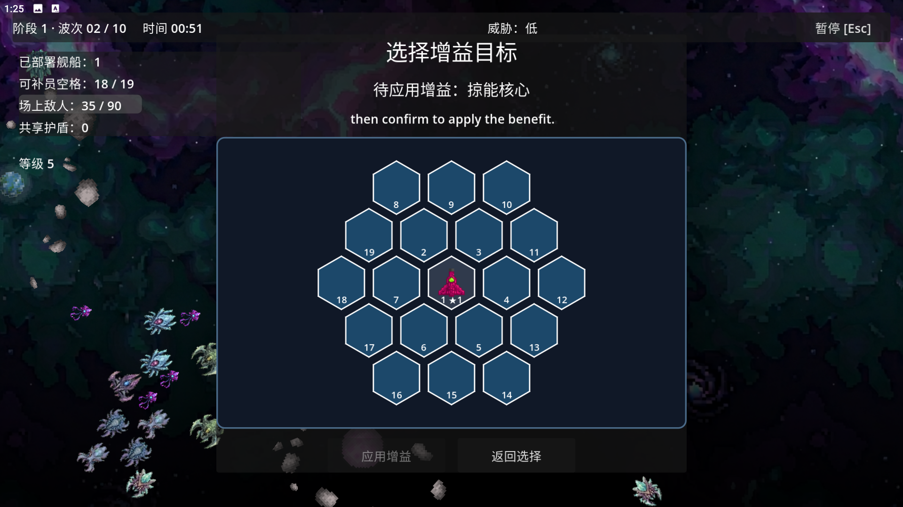
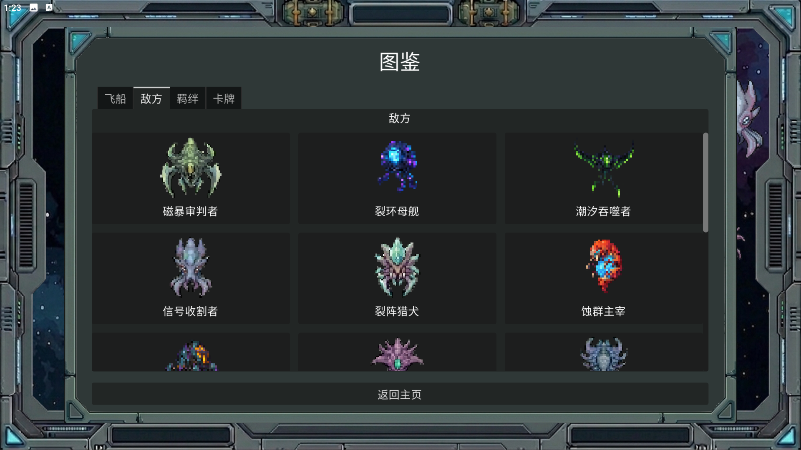
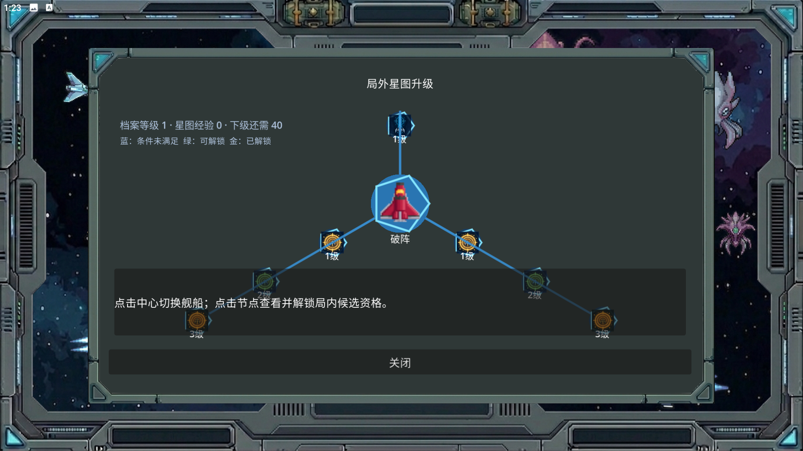

# 星海奇点

<p align="center">
  
</p>

<p align="center"><strong>Singularity of Star Ocean</strong></p>

《星海奇点》是一款以太空舰队为主题的 2D 生存、编队与构筑游戏。玩家以旗舰为舰队核心，在持续到来的敌方波次中移动、作战、收集经验，并通过局内强化、卡牌、羁绊和舰船组合逐步形成不同流派。

项目目前处于开发阶段，部分设计数据和 TapTap 发布能力仍在接入与验证中。

## 核心玩法

- 操控旗舰和舰队在太空战场中移动，抵御连续敌袭。
- 收集经验并在局内选择强化，调整攻击、移动、护盾、射程和舰队成员。
- 通过不同舰船的武器、主动能力、被动能力和推荐站位组织舰队。
- 使用卡牌与羁绊构建战斗流派。
- 在局外积累星图经验，沿舰船专属升级分支解锁永久能力。
- 通过舰船档案和图鉴查看飞船、敌人、羁绊、卡牌及解锁条件。

## 当前内容

仓库当前包含：

- 11 个玩家舰船资源，其中 10 组完整舰船设计数据。
- 16 种敌人设计，覆盖常规、精英、召唤和 Boss 类型。
- 84 张卡牌设计资源。
- 8 组羁绊设计资源。
- 89 个舰船星图升级节点。
- 5、10、20 波次与轻松、标准、困难三档本局配置。
- 中文、英文界面文本。
- 主菜单、舰队配置、战斗 HUD、暂停、结算、设置、档案、图鉴和局外星图升级界面。

部分设计资源通过 `IsImplementedInRuntime` 标记区分“已有设计数据”和“已接入运行时效果”，因此资源数量不等于所有内容均已完成最终实现。

## 游戏截图

| 主页面 | 核心战斗 |
| --- | --- |
|  |  |

| 舰队编辑 | 图鉴页面 |
| --- | --- |
|  |  |

### 局外星图升级




## 开发环境

建议使用：

- Godot 4.7 Stable Mono
- .NET SDK 8 或更新的兼容版本
- Visual Studio、JetBrains Rider 或 Visual Studio Code

克隆项目后，使用 Godot Mono 编辑器打开项目根目录中的 `project.godot`。首次打开时等待 Godot 完成资源导入和 C# 解决方案加载。

命令行构建检查：

```powershell
dotnet restore HexGame.csproj
dotnet build HexGame.csproj --no-restore
```

项目主场景已经配置，可直接从 Godot 编辑器运行。

## Android 与 TapTap

项目已经配置 Android 导出预设，并启用 Gradle 自定义构建。当前集成了第三方 Godot TapTap SDK 插件：

- TapSDK Core 4.10.7
- TapTap 登录
- 合规认证，包括实名认证和未成年人防沉迷
- 上游插件：<https://github.com/godothub/godot-taptap>


插件目前是上游完整版本，还包含动态、更新、成就、云存档、好友和排行榜等依赖。若发行版本只使用登录与合规认证，建议在发布前裁剪未使用模块与权限。


